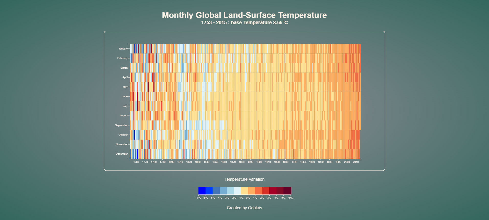

# FCC - Heat Map


Live demo of **[Heat Map](https://codepen.io/odakris/full/vYQGNab)**

## Description

This is a Heat Map of Monthly Global Land-Surface Temperature (1753 - 2015).

This project is part of the **[freeCodeCamp](https://www.freecodecamp.org/learn/data-visualization/data-visualization-projects/visualize-data-with-a-heat-map)** Data Visualization projects certification.

<p align="center">
  
</p>

## Instructions

Clone this repository and launch :

```
index.html
```
